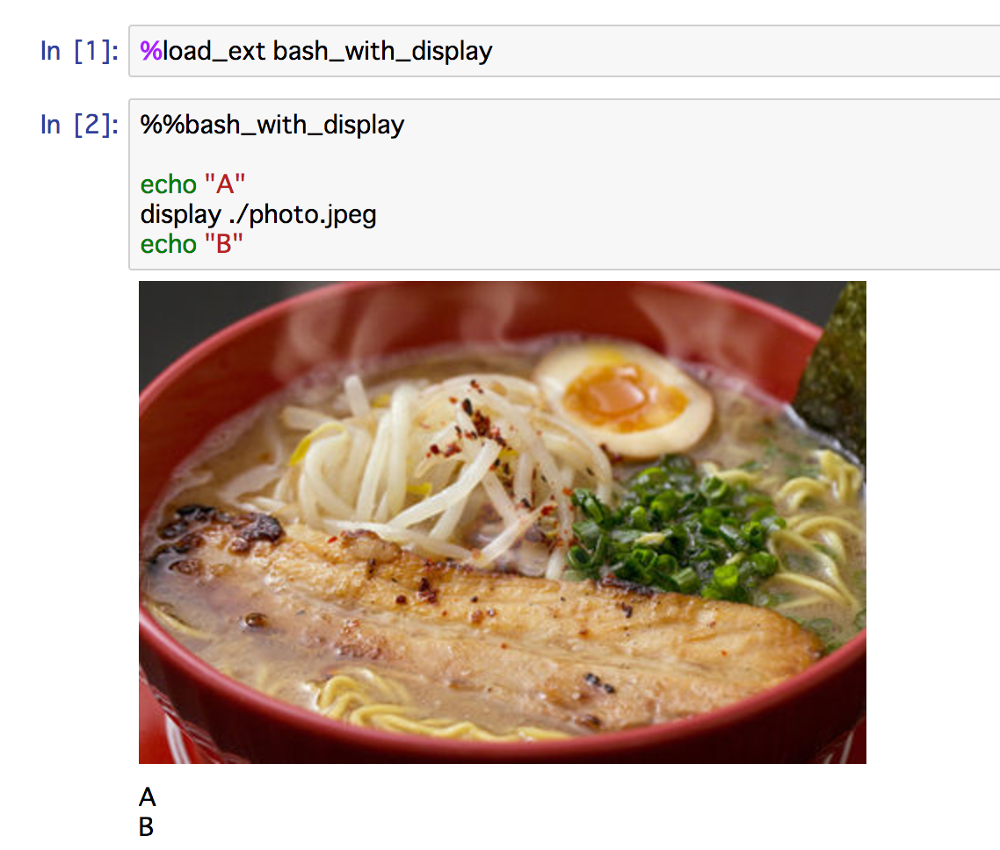

# BashWithDisplayMagic

Display images in [Jupyter notebook](http://jupyter.org/) %%bash cell

## Usage



## Setup

1. clone and install

```shell
git clone https://github.com/Kiikurage/bash_with_display.git
```

2. Install

```shell
cd bash_with_display
python setup.py install
```
